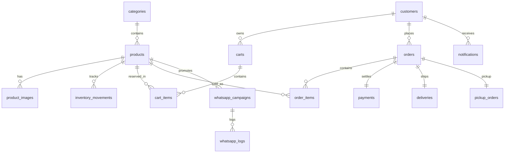

# Diagrama ER

## Tabelas chave

- `products`: fonte de verdade de status e estoque
- `carts` e `cart_items`: suporte a lock temporario de itens unicos
- `orders`, `payments`, `deliveries`: jornada operacional de venda
- `financial_transactions`: base para fluxo de caixa
- `settings`: configuracoes de loja e integracoes

